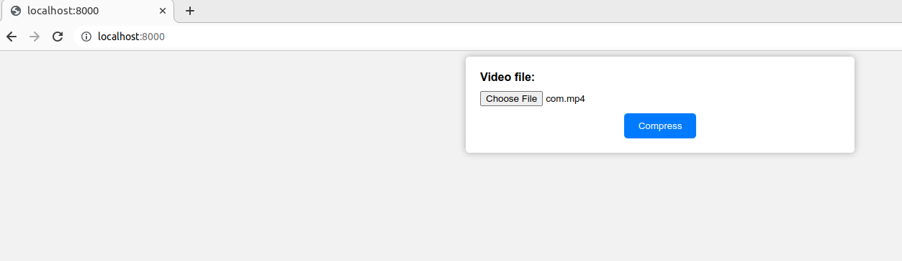

# Video Compression

# 

This project provides two scripts for compressing video files: one written in Laravel and one written in Python. Both scripts use the FFMpeg library to compress the input video file and save the compressed output to a new file.

## Requirements
To use these scripts, you must have FFMpeg installed on your system. You can download FFMpeg from the official website: https://ffmpeg.org/download.html

OR run command in terminal
- for laravel `composer require php-ffmpeg/php-ffmpeg`
- for python `pip install ffmpeg-python`

## Laravel
The Laravel script is written in PHP and uses the php-ffmpeg library to interact with FFMpeg. To use the script:

1 - Clone this repository and navigate to the project directory:
`git clone https://github.com/marwan-kotb/Compression`
`cd your-repo`

2 - Install the required dependencies using Composer: 
`composer install`

3 - Start the Laravel development server:
`php artisan serve`

4 - Open your web browser and navigate to http://localhost:8000 to access the application.

5 - Upload a video file using the form on the home page.

6 - Click the "Compress" button to compress the video file.

7 - The compressed video file will be downloaded to your computer.

## Python

The Python script is a command-line tool that uses the ffmpeg-python library to interact with FFMpeg. To use the script:

1 - Install the required dependencies using pip:
`pip install ffmpeg-python`

2 - Open a terminal or command prompt and navigate to the directory where the compress.py file is located.

3 - Run the script, providing the path to the input video file and the path to the output compressed video file:
`python compress.py input.mp4 output.mp4 --crf 28 --preset slow --tune film`

4 - The compressed video file will be saved to the specified output file path.

## Note
- I uploaded two videos:
one original, 
second compressed and downloaded from localhost (web application with laravel)
`From 5M to 200KB`

